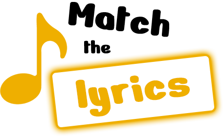
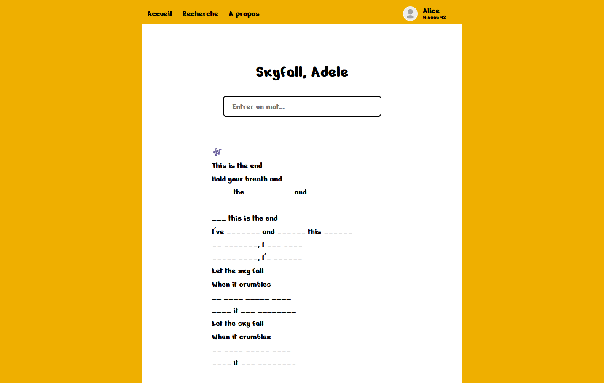
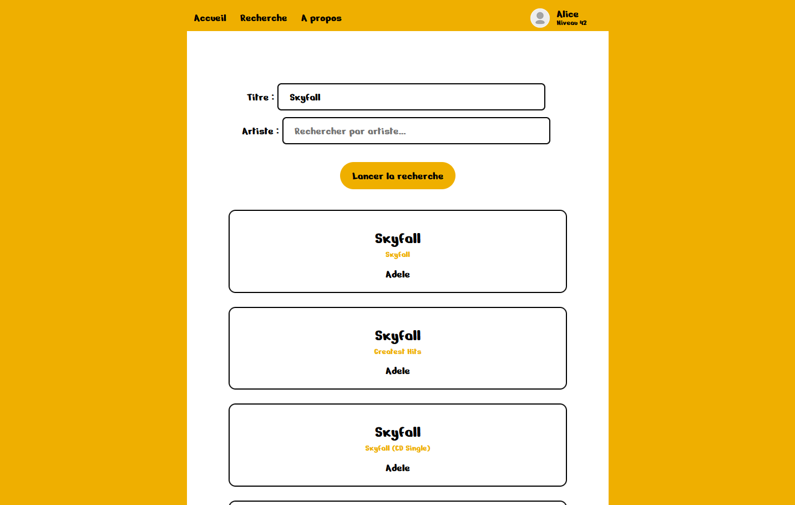

# Match the lyrics



## Principe

Match the Lyrics est un jeu en ligne consistant à retrouver les paroles d'une chanson sélectionnée.

Pour y jouer, il suffit de chercher une chanson ou un artiste grâce à la barre de recherche de la page d'accueil, puis de sélectionner la chanson de son choix.

Une fois la chanson sélectionnée, le joueur peut en deviner les paroles en écrivant les mots dans la barre prévue à cet effet. S'il est juste, le mot est automatiquement détecté et les paroles sont complétées.



Quand le joueur a terminé ou souhaite obtenir la solution, il peut appuyer sur le bouton en bas de la page pour obtenir son score et afficher le reste des paroles.

## API

L'API utilisée pour ce site est [LRCLIB](https://lrclib.net/), qui donne accès à une base de données libre de paroles de chansons.



## Lancement

Pour faire tourner le site localement, il faut se placer dans le dossier du projet et lancer la commande :

```
npm run dev
```